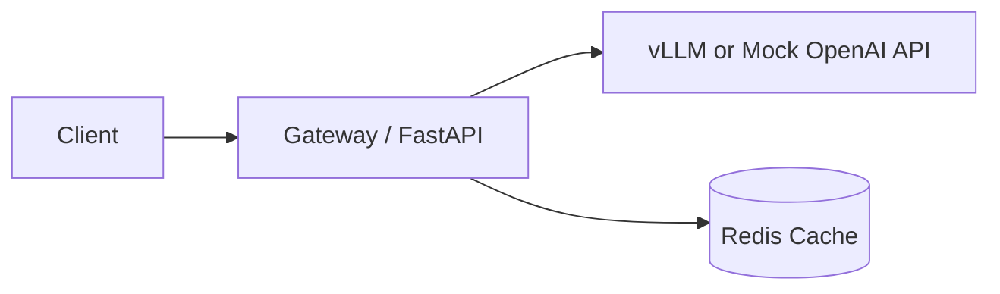

# vLLM OpenAI-Compatible Server Gateway Benchmarks


Local LLM serving stack with a FastAPI gateway in front of a vLLM OpenAI-compatible server.

## Quickstart

### Prerequisites
- Python 3.11+
- Docker + Docker Compose (for full GPU stack)
- Optional: NVIDIA GPU + CUDA runtime for vLLM

### Install
```bash
python -m pip install --upgrade pip
pip install -e .[dev]
```

## Demo modes

### 1) CPU / no-GPU mock mode (always works)
Runs a local mock OpenAI-compatible upstream plus the gateway, then validates `/health` and `/chat`.

```bash
make demo
```

### 2) GPU mode (optional, real vLLM container)
```bash
make up-gpu
```

You can still use generic profile mode:
```bash
make up           # default profile gpu
USE_GPU=0 make up # cpu profile
```

## Architecture



## Benchmarking

Run tiny/local benchmark (self-contained mock mode):
```bash
make bench
```

Outputs:
- timestamped report: `reports/bench-<epoch>.md`
- latest snapshot: `reports/latest.md`

Metrics include:
- p50 latency
- p95 latency
- RPS
- error rate
- tokens/sec (approx)

Prompt set lives in `data/prompts.jsonl`.

## Gateway hardening knobs

Configured via `GATEWAY_` env vars (`gateway/app/config.py`):
- `GATEWAY_RATE_LIMIT_RPS`
- `GATEWAY_RATE_LIMIT_BURST`
- `GATEWAY_REQUEST_SIZE_LIMIT_BYTES`
- `GATEWAY_MAX_TOKENS_CAP`
- `GATEWAY_RETRY_ATTEMPTS`
- `GATEWAY_RETRY_MIN_SECONDS`
- `GATEWAY_RETRY_MAX_SECONDS`

Structured JSON logs include `request_id` and `model_id`.

## Performance knobs

- **Batch size (server-side):** tune vLLM launch args in `infra/docker-compose.yml` (for example `--max-num-seqs`).
- **Max tokens:** request `max_tokens` and gateway cap via `GATEWAY_MAX_TOKENS_CAP`.
- **Concurrency (benchmark):** `BENCH_CONCURRENCY` or `--concurrency` in `bench/run_bench.py`.

Example:
```bash
BENCH_TOTAL_REQUESTS=20 BENCH_CONCURRENCY=4 make bench
```

## Testing / CI

Local checks:
```bash
make lint
make typecheck
make test
make smoke
make demo
make bench
```

CI (`.github/workflows/ci.yml`) runs lint, typecheck, tests, smoke, mock demo mode, tiny bench mode, and optional Docker Compose validation.

## Troubleshooting

- `make demo` fails: inspect `/tmp/gateway-demo.log` and `/tmp/mock-openai-demo.log`.
- `make bench` fails: inspect `/tmp/gateway-bench.log` and `/tmp/mock-openai-bench.log`.
- GPU issues: verify NVIDIA container runtime and use a smaller model.

## Development

```bash
make setup
pre-commit run --all-files
```
